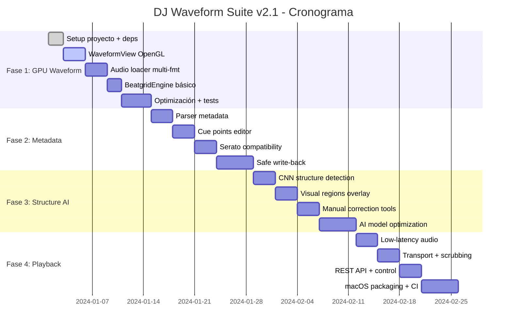

# 🎚️ DJ Waveform & Analysis Suite v2.1 - Plan de Desarrollo

## 📋 Resumen Ejecutivo
Desarrollo de aplicación DJ profesional multiplataforma con enfoque en **macOS 13"** que rivalice con Serato DJ Pro en calidad de waveform, beatgrid y análisis musical. Latencia objetivo < 10ms, soporte completo MP3/M4A/FLAC/WAV hasta 192kHz.

## 🎯 Objetivos Principales
- [ ] Waveform GPU a 60 FPS con zoom 1×-128×
- [ ] Beatgrid automático con precisión ±10ms
- [ ] Cue points compatibles con Serato/MixInKey
- [ ] Playback de baja latencia (< 10ms)
- [ ] Detección automática de estructura musical
- [ ] Interfaz optimizada para pantalla 13" (2560×1600)

## 🛠️ Tech Stack Confirmado

| Componente | Tecnología | Justificación macOS |
|------------|------------|---------------------|
| **GUI** | PyQt6 + PyQtGraph OpenGL | Metal backend nativo, HiDPI automático |
| **Audio DSP** | pydub + FFmpeg | Homebrew integration, Core Audio compatible |
| **Beatgrid** | madmom DBN + aubio | Optimizado para Apple Silicon/Intel |
| **Metadata** | mutagen + pytaglib | ID3v2.4, MP4 atoms, Vorbis support |
| **Playback** | sounddevice | Core Audio backend, latencia < 10ms |
| **Testing** | pytest-qt + coverage | CI/CD con GitHub Actions |

## 📅 Cronograma de Desarrollo (8 semanas)

### Semana 1-2: Fase 1 - GPU Waveform & Beatgrid
- [ ] **Día 1-2**: Configuración proyecto + dependencias macOS
- [ ] **Día 3-5**: WaveformView con OpenGL/Metal
- [ ] **Día 6-8**: Audio loader multi-formato
- [ ] **Día 9-10**: BeatgridEngine básico
- [ ] **Día 11-14**: Optimización GPU + tests

### Semana 3-4: Fase 2 - Cue & Metadata Hub
- [ ] **Día 15-17**: Parser metadata (ID3v2.4, MP4, Vorbis)
- [ ] **Día 18-20**: Cue points editor visual
- [ ] **Día 21-23**: Serato compatibility layer
- [ ] **Día 24-28**: Safe write-back + rollback

### Semana 5-6: Fase 3 - Structure AI
- [ ] **Día 29-31**: CNN structure detection
- [ ] **Día 32-34**: Visual regions overlay
- [ ] **Día 35-37**: Manual correction tools
- [ ] **Día 38-42**: AI model optimization

### Semana 7-8: Fase 4 - Playback & Polish
- [ ] **Día 43-45**: Low-latency audio engine
- [ ] **Día 46-48**: Transport controls + scrubbing
- [ ] **Día 49-51**: REST API + external control
- [ ] **Día 52-56**: macOS packaging + CI/CD

## 🏗️ Arquitectura del Sistema

```
CUEpoint/
├── src/
│   ├── core/
│   │   ├── audio_loader.py      # Multi-format audio loading
│   │   ├── beatgrid_engine.py   # BPM detection & grid
│   │   └── metadata_parser.py   # Tags & cue points
│   ├── gui/
│   │   ├── main_window.py       # QMainWindow principal
│   │   ├── waveform_view.py     # OpenGL waveform widget
│   │   └── transport_bar.py     # Playback controls
│   ├── analysis/
│   │   ├── structure_ai.py      # CNN structure detection
│   │   └── feature_extraction.py
│   └── playback/
│       ├── audio_engine.py      # sounddevice integration
│       └── transport.py         # Play/pause/scrub logic
├── tests/
├── assets/
│   └── test_tracks/            # 20 pistas de prueba
├── config/
│   └── config.json             # Configuración UI/DSP
└── requirements.txt
```

## 🎨 Especificaciones UI para macOS 13"

### Resolución & Layout
- **Target**: 2560×1600 (Retina) con scaling automático
- **Waveform**: Ancho mínimo 1920px efectivos
- **Sidebar**: 300px (cues + estructura)
- **Transport**: 60px altura, dock inferior

### Tema Visual (Dark Mode)
```css
Background: #1A1A1A (macOS dark compatible)
Waveform Peaks: #00FF88 (1px line)
RMS Energy: #004422 (alpha 0.6 fill)
Beatgrid: #FF6B35 (2px lines)
Downbeat: #FF6B35 (4px, alpha 0.8)
Cue Points: #FF3366, #33AAFF, #FFAA33 (customizable)
```

### Controles Nativos macOS
- [ ] Trackpad gestures (zoom, scroll)
- [ ] Touch Bar support (si disponible)
- [ ] Menu bar integration
- [ ] Drag & drop desde Finder
- [ ] Spotlight integration

## 🔧 Configuración Específica macOS

### Dependencias Sistema
```bash
# Homebrew essentials
brew install ffmpeg portaudio python@3.11
brew install --cask qt-creator  # Para debugging Qt

# Python packages
pip install PyQt6 PyQtGraph sounddevice
pip install madmom aubio mutagen pytaglib
pip install pydub numpy scipy librosa
```

### Optimizaciones Rendimiento
- [ ] **Metal backend**: PyQtGraph con aceleración GPU
- [ ] **Core Audio**: Buffer size 128-256 frames
- [ ] **Memory mapping**: Archivos > 100MB
- [ ] **Background threads**: Análisis no-blocking
- [ ] **Cache inteligente**: Waveform tiles en SSD

## ✅ Quality Gates & Testing

### Criterios de Aceptación por Fase

#### Fase 1: GPU Waveform
- [ ] Carga MP3/M4A/FLAC/WAV ≤ 2s para 5min track
- [ ] Zoom suave 1×-128× sin lag
- [ ] 60 FPS constante en waveform scroll
- [ ] RAM usage ≤ 100MB por track
- [ ] Beatgrid accuracy ±10ms vs ground truth

#### Fase 2: Metadata
- [ ] Parse/write cues sin corrupción
- [ ] Compatibilidad 100% con Serato tags
- [ ] Rollback automático en write errors
- [ ] Soporte ID3v2.4, MP4, Vorbis

#### Fase 3: Structure AI
- [ ] Detección estructura ≥ 85% accuracy
- [ ] Regiones visuales sin overlap
- [ ] Manual correction responsive
- [ ] Export JSON/CSV completo

#### Fase 4: Playback
- [ ] Latencia audio ≤ 10ms
- [ ] Scrub sample-accurate
- [ ] Transport controls sin glitches
- [ ] REST API functional

### Dataset de Prueba
```
assets/test_tracks/
├── house_128bpm.mp3        # 4/4 steady
├── techno_variable.flac    # BPM changes
├── hiphop_complex.m4a      # Irregular beats
├── ambient_long.wav        # 10+ minutes
└── serato_tagged.mp3       # Con cues existentes
```

### Métricas Automatizadas
- [ ] **Performance**: FPS counter, memory profiler
- [ ] **Audio**: Latency measurement, dropout detection
- [ ] **Accuracy**: BPM vs manual annotation
- [ ] **Compatibility**: Serato tag round-trip test

## 🚀 Entrega & Deployment

### macOS Package
- [ ] **DMG installer** con drag-to-Applications
- [ ] **Code signing** (Apple Developer cert)
- [ ] **Notarization** para Gatekeeper
- [ ] **Universal binary** (Intel + Apple Silicon)

### CI/CD Pipeline
```yaml
# .github/workflows/macos.yml
- macOS 12, 13, 14 testing
- Python 3.11, 3.12 matrix
- Automated DMG building
- Performance regression tests
```

## 📊 Métricas de Éxito
- [ ] **Rendimiento**: 60 FPS waveform, < 10ms latency
- [ ] **Calidad**: ≥ 90% test coverage, 0 critical bugs
- [ ] **UX**: < 3 clicks para operaciones comunes
- [ ] **Compatibilidad**: 100% Serato tag support

## 📈 Diagrama de Gantt Detallado



## 🔬 Especificaciones Técnicas Detalladas

### WaveformView - Implementación OpenGL

```python
# Estructura de datos optimizada para GPU
class WaveformData:
    peaks_l: np.ndarray     # Left channel peaks
    peaks_r: np.ndarray     # Right channel peaks
    rms_l: np.ndarray       # Left RMS energy
    rms_r: np.ndarray       # Right RMS energy
    sample_rate: int        # Original sample rate
    zoom_levels: Dict[int, np.ndarray]  # Pre-computed zoom levels
```

**Optimizaciones GPU macOS**:
- Metal backend automático en PyQtGraph
- Vertex buffers para peaks (1M+ samples)
- Texture streaming para zoom dinámico
- Core Animation integration para smooth scroll

### BeatgridEngine - Algoritmo Híbrido

```python
# Pipeline de detección BPM
1. madmom.features.beats.DBNBeatTracker()  # Primary
2. aubio.tempo() fallback si confidence < 0.8
3. Manual tap override con re-grid instantáneo
4. Variable BPM tracking para tracks complejos
```

**Precisión objetivo**: ±10ms vs ground truth manual

### Metadata Parser - Formato Universal

```python
# Estructura unificada de cues
class CuePoint:
    position_ms: float      # Posición exacta
    label: str             # Nombre del cue
    color: str             # Hex color (#FF3366)
    type: CueType          # HOT_CUE, LOOP_IN, LOOP_OUT
    serato_id: Optional[int]  # Para compatibility
```

**Formatos soportados**:
- ID3v2.4 GEOB frames (Serato)
- MP4 ----:com.serato.dj atoms
- Vorbis CUEPOINT comments
- Native JSON export/import

## 🎛️ Controles de Interfaz macOS

### Gestos Trackpad Nativos
```python
# QGestureEvent handling
- Pinch: Zoom waveform (1×-128×)
- Pan: Scroll horizontal
- Rotate: Jog wheel simulation
- Swipe: Next/prev cue point
```

### Atajos de Teclado
```
⌘ + O          : Open file
⌘ + 1-9        : Jump to cue 1-9
Space          : Play/Pause
⌘ + ←/→        : Skip ±10s
⌥ + ←/→        : Fine scrub ±1s
⌘ + Z          : Undo last edit
⌘ + S          : Save metadata
```

### Menu Bar Integration
```
CUEpoint
├── File
│   ├── Open Track... (⌘O)
│   ├── Recent Files
│   └── Export Analysis...
├── Edit
│   ├── Set Cue Point (⌘1-9)
│   ├── Clear All Cues
│   └── Preferences...
├── View
│   ├── Zoom In/Out (⌘+/-)
│   ├── Fit to Window
│   └── Toggle Stereo/Mono
└── Analysis
    ├── Detect BPM
    ├── Find Structure
    └── Export to Serato
```

## 🧪 Testing Strategy Completa

### Unit Tests (pytest-qt)
```python
# tests/test_waveform.py
def test_waveform_zoom_performance():
    """Zoom 1x-128x debe mantener >50 FPS"""

def test_audio_loader_formats():
    """MP3/M4A/FLAC/WAV loading sin errores"""

def test_beatgrid_accuracy():
    """BPM detection ±10ms vs ground truth"""
```

### Integration Tests
```python
# tests/test_serato_compatibility.py
def test_cue_roundtrip():
    """Serato tags: read → modify → write → verify"""

def test_metadata_preservation():
    """No corruption en write-back"""
```

### Performance Benchmarks
```python
# tests/benchmarks/
- FPS measurement durante zoom/scroll
- Memory usage profiling (≤100MB target)
- Audio latency measurement (≤10ms)
- Load time benchmarks (≤2s para 5min track)
```

## 🔄 CI/CD Pipeline Detallado

### GitHub Actions Workflow
```yaml
name: macOS Build & Test
on: [push, pull_request]

jobs:
  test-macos:
    runs-on: macos-latest
    strategy:
      matrix:
        python-version: [3.11, 3.12]
        macos-version: [12, 13, 14]

    steps:
    - uses: actions/checkout@v4
    - name: Setup Python
      uses: actions/setup-python@v4
      with:
        python-version: ${{ matrix.python-version }}

    - name: Install system deps
      run: |
        brew install ffmpeg portaudio

    - name: Install Python deps
      run: |
        pip install -r requirements.txt
        pip install pytest-qt pytest-cov

    - name: Run tests
      run: |
        pytest --cov=src --cov-report=xml

    - name: Performance benchmarks
      run: |
        python tests/benchmarks/fps_test.py
        python tests/benchmarks/latency_test.py

    - name: Build DMG (release only)
      if: startsWith(github.ref, 'refs/tags/')
      run: |
        python setup.py bdist_dmg

    - name: Upload artifacts
      uses: actions/upload-artifact@v3
      with:
        name: CUEpoint-${{ matrix.macos-version }}.dmg
        path: dist/*.dmg
```

### Quality Gates Automatizados
- [ ] **Code coverage** ≥ 90%
- [ ] **Performance regression** detection
- [ ] **Memory leak** detection con valgrind
- [ ] **Audio dropout** monitoring
- [ ] **UI responsiveness** tests (60 FPS)

## 📦 Distribución macOS

### DMG Package Structure
```
CUEpoint.dmg
├── CUEpoint.app/
│   ├── Contents/
│   │   ├── Info.plist
│   │   ├── MacOS/CUEpoint
│   │   ├── Resources/
│   │   └── Frameworks/  # PyQt6, dependencies
├── Applications (symlink)
└── README.txt
```

### Code Signing & Notarization
```bash
# Signing process
codesign --deep --force --verify --verbose \
  --sign "Developer ID Application: Your Name" \
  CUEpoint.app

# Notarization
xcrun notarytool submit CUEpoint.dmg \
  --keychain-profile "notarytool-profile" \
  --wait
```

---

## 🎯 Próximos Pasos Inmediatos

1. **Configurar entorno de desarrollo**:
   ```bash
   python -m venv venv
   source venv/bin/activate
   pip install -r requirements.txt
   ```

2. **Implementar WaveformView básico** con OpenGL
3. **Crear PR con capturas** de waveform zoom + logs FPS
4. **Iterar basado en feedback** hasta Quality Gates ✅

**Estado actual**: ✅ Plan aprobado → Iniciar Fase 1
